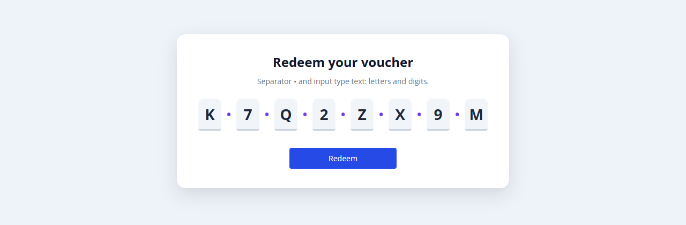

# React OTP

A versatile one-time password input for Mendix. React OTP shows one box per character for OTP, verification and PIN codes: the cursor moves to the next box while typing, Backspace goes back, and a pasted code (or one offered by the phone from an SMS) is spread over the boxes.


## Documentation

- [React OTP 10.24.17.docx](docs/React%20OTP%2010.24.17.docx): install, upgrade, configuration, properties, examples, styling and limitations.
- [Marketplace documentation](docs/Marketplace%20Documentation%20-%20React%20OTP.md): the same in short form.

## Version 1.1.0 for Mendix Studio Pro 10.24.17

React OTP 1.1.0 is rebuilt for **Mendix Studio Pro 10.24.17**.

### Download

- Download `mendix.ReactOTP.mpk` from the release [Version1.1.0](https://github.com/bharathidas/ReactOTP/releases/tag/Version1.1.0) or from the root of this repository.
- Copy it into the `widgets` folder of your app and press **F4** (App > Synchronize App Directory) in Studio Pro.
- The previous package is in release [version1](https://github.com/bharathidas/ReactOTP/releases/tag/version1).

### Changes in 1.1.0

- Built with `@mendix/pluggable-widgets-tools` 10.16.0 for Studio Pro 10.24.17 and React 18, as a production build, with react-otp-input 3.1.1. The package is about 12 KB (1.0.0: about 44 KB).
- **Number of inputs**, **Input type** and **Separator** are optional. Without them the widget shows 4 text boxes with `-` between them. In 1.0.0 all three attributes were required.
- An empty Number of inputs attribute (Mendix passes it as 0) shows 4 boxes; in 1.0.0 it showed no boxes. Values outside 1–20 also use 4.
- The input type ignores case and spaces; an unknown value uses `text`.
- Placeholder: one character is shown in every box (for example `0`), a longer text gives one character per box. In 1.0.0 it only worked when its length was exactly the number of boxes.
- When the attribute is read-only (Editability, a read-only data view or access rules) the boxes are disabled. In 1.0.0 they stayed enabled.
- New **On change** and **On complete** actions (On complete runs when every box is filled) and a new **Auto focus** option.
- The first box has `autocomplete="one-time-code"` for SMS code autofill on phones.
- A validation message of the attribute is shown below the boxes.
- The default box style is CSS (`widget-reactotp-input-default`) instead of inline styles: the same look on a desktop, a focus colour, a light placeholder, and smaller boxes on phones so six boxes fit on a 375 px screen (in 1.0.0 they ran off the screen).
- The class, style, tab index and Name set in Studio Pro are applied.
- No debug messages in the browser console.
- Studio Pro design mode shows four boxes. Clearer captions and descriptions. The widget ID and property keys are the same as in 1.0.0, so existing pages keep their settings.

Tested in a Mendix 10.24.17 app (41 automated checks): number of boxes, input types, separator, placeholder, typing, Backspace, arrow keys, paste, letters in a number box, a value changed elsewhere, read-only, On change, On complete, auto focus, custom classes, tab index and a phone-sized window.

### Upgrading from 1.0.0

1. Replace `mendix.ReactOTP.mpk` in the `widgets` folder of your app with the 1.1.0 file.
2. Press **F4** (Synchronize App Directory).
3. Studio Pro reports that the widget definition has changed. Right-click the error and choose **Update all widgets**. Your settings are kept.
4. If the running app still shows the old widget, stop it, choose **App > Clean Deployment Directory** and run it again.

Check after upgrading: if you used Input class or Container class, your class now fully controls the boxes (1.0.0 also set an inline width of 1em on each box), so give the boxes a width in your class.

### Source code and build

The widget source is in the [`reactOTP`](reactOTP) folder.

```
cd reactOTP
npm install
npm run release
```

The package is created in `reactOTP/dist/1.1.0/mendix.ReactOTP.mpk`. Node.js 16 or later is required.

---

## Features

### •	Value:
The String attribute that holds the code. Required.
### •	Number of inputs:
Integer attribute with the number of boxes, 1–20. Default is 4.
### •	Input type:
String attribute: `text`, `number`, `tel` or `password`. Default is `text`. `number` and `tel` accept only digits and show the number keyboard on phones.
### •	Separator:
String attribute with the text between the boxes. Default is `-`.
### •	Placeholder:
String attribute shown in empty boxes: one character for every box, or one character per box.
### •	Input class:
CSS class for each box; replaces the default box style.
### •	Container class:
CSS class for the row of boxes; replaces the default row style.
### •	Auto focus:
Puts the cursor in the first box when the page opens.
### •	Events:
On change and On complete actions.

## Dependencies:
•	Mendix Studio Pro 10.24.17 (widget 1.1.0). Widget 1.0.0: Mendix modeler 9.12.4.

## Issues, suggestions and feature requests
https://github.com/bharathidas/ReactOTP/issues

## Screenshots (version 1.1.0, Mendix 10.24.17)

| | |
| --- | --- |
|  |  |
|  |  |
|  |  |

## Version 1.0.0

Demo of version 1.0.0: https://reactotp-sandbox.mxapps.io/login.html?profile=Responsive


